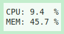
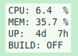

fstats是一款用于显示系统信息的悬浮窗软件, 支持用户自定义显示信息.

- 默认显示



- 增加开机时间和进程监控



或者, 也可以使用fstats来显示你喜欢的某些格言. 已将一些配置脚本提交到[这里](./scripts/README.md).

### 安装

```
pip3 install fstats
```

### 使用

通过终端在后台运行, 也可以配置开机自启动:

```
fstats &
```

### 用户自定义

fstats支持显示用户自定义信息, 如果需要使用用户自定义功能, 则需要在`~/.fstats/`做如下配置:

1. 添加`config.json`:

fstats启动的时候, 会读取一次`config.json`以获取各module和其他配置信息.

```json
{
    "width": 96,
    "height": 48,
    "style": "<HOME path>/.fstats/style.py",
    "items": [
        ["CPU", "<HOME path>/.fstats/cpu.py", "{:<3}: {:<5}%"],
        ["MEM", "<HOME path>/.fstats/mem.py", "{:<3}: {:<5}%"]
    ]
}
```

`width` & `height` 描述了悬浮窗的大小, 可以根据自定义信息的内容大小设置.

2. 编写`items`脚本:

`items`的每一项称为`item`, `item`描述的是:

```python
[名称, 脚本, 格式]
```

fstats会将名称和脚本的执行结果显示在悬浮窗上, 默认情况下, 每一个`item`占据一行显示, 因此格式中需要描述名称和脚本的组合关系.

`items`的各个脚本会在每次循环的时候都执行一遍, 每个脚本需要定一个`info() -> any`方法. 

- `<HOME path>/.fstats/cpu.py`:

```python
import psutil

def info():
    return psutil.cpu_percent(interval=1)
```

- `<HOME path>/.fstats/mem.py`:

```python
import psutil

def info():
    return psutil.virtual_memory().percent
```

3. 编写`style`脚本:

在`items`执行完成之后, 会执行`style`脚本, 通过该脚本可以修改悬浮窗的样式, `style`脚本中需要定义一个`style(infoItems, label) -> None`方法, `infoItems`是`items`脚本的执行结果, `label`对应tkinter中的`Label`对象.

一般情况下`infoItems`是一个列表, 每个元素如下表示:

```python
 item[0]            item[1]      item[2]                item[-1]
[名称(比如CPU/MEM等), 结果(比如80), 格式(python支持的format, 比如"{:>2} {:>2}", module)]
```

如果在`config.json`中定义了`version`, 且其值为`v2`, 则`infoItems`是一个列表, 每个元素如下表示:

```python
{
    "header": item[0],
    "content": item[1],
    "format": item[2],
    "module": item[-1],
}
```

- `<HOME path>/.fstats/style.py`:

```python
# infoItems contains all items
#    infoItems: [item0, item1, ...]
#    item[0-n]: [name, value, format]
# label: tkinter Label 
def style(infoItems, label):
    high = False
    for item in infoItems:
        if item[0] in {'CPU', 'MEM'} and item[1] > 90:
            high = True
    if high:
        label['bg'] = 'red'
        label['fg'] = 'white'
    else:
        label['bg'] = 'white'
        label['fg'] = 'black'
```